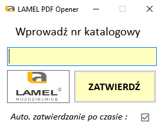
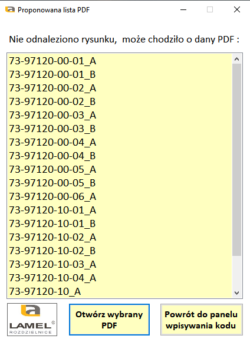

## PDF-Opener-using-Barcode-Scanner

Program szuka PDF w docelowym folderze zdefiniowanym
w lokalizacja.txt. 
Posiada funkcjonalność autozatwierdzania nr katologowego po zadanym czasie
okreslonym w pliku czas_opoznienia_[ms].txt , opcjonalnie 1500 ms - przydatne,
gdy maszyna nie posiada klawiatury/myszki, tylko ekran dotykowy.

 